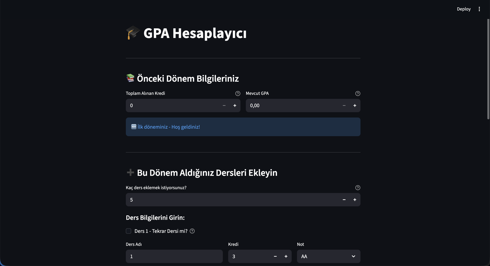
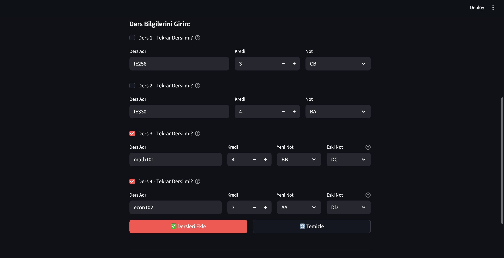
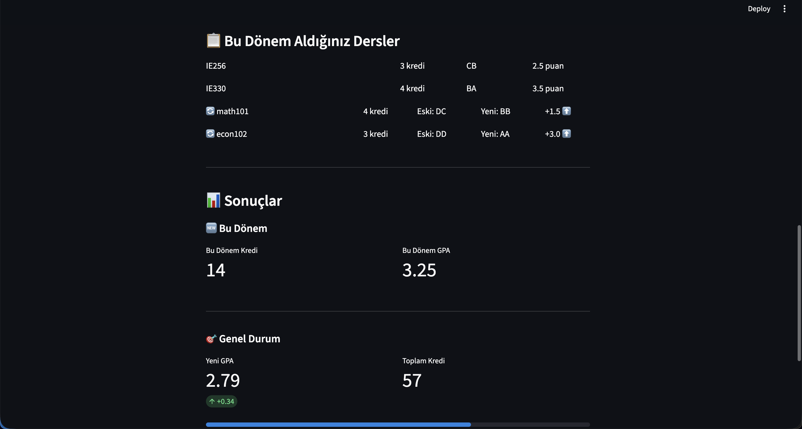

# 🎓 GPA Calculator

A modern, user-friendly GPA (Grade Point Average) calculator built with Streamlit. Perfect for university students to calculate their cumulative GPA and track academic performance.



## ✨ Features

- **Cumulative GPA Calculation**: Input your previous total credits and current GPA to calculate updated results
- **Bulk Course Entry**: Add multiple courses at once for faster data entry
- **Retake Course Support**: Special handling for courses taken multiple times - automatically replaces old grades
- **Real-time Updates**: GPA calculations update instantly as you input data
- **Clean Interface**: Modern, intuitive design with Turkish university grading system (AA to FF)
- **Visual Feedback**: See your GPA change with delta indicators

## 🚀 Quick Start

### Prerequisites

- Python 3.7 or higher
- pip package manager

### Installation

1. Clone the repository:
```bash
git clone https://github.com/yourusername/gpa-calculator.git
cd gpa-calculator
```

2. Install dependencies:
```bash
pip install -r requirements.txt
```

3. Run the application:
```bash
streamlit run gpa_hesaplayici.py
```

The app will open automatically in your browser at `http://localhost:8501`

## 📦 Dependencies

- **Streamlit** (^1.28.0): Web application framework for data apps

## 🎯 How to Use

1. **Enter Previous Semester Info** (optional):
   - Input your total completed credits
   - Input your current GPA
   - Leave as 0 if this is your first semester

2. **Add This Semester's Courses**:
   - Set how many courses you want to add
   - For each course, enter:
     - Course name (defaults to numbers for quick entry)
     - Credit hours
     - Letter grade (AA, BA, BB, CB, CC, DC, DD, FD, FF)
   - Check "Retake" if you're repeating a course, then select the old grade

3. **Calculate**:
   - Click "Add Courses" button
   - View your semester GPA and updated cumulative GPA

## 🔄 Retake Course Logic

When you mark a course as a retake:
- The old grade is automatically removed from your GPA calculation
- The new grade replaces it
- Credits are not duplicated (they were already counted)
- See the grade improvement directly in the results

## 📊 Grading System

Turkish university letter grade system:
- AA: 4.0
- BA: 3.5
- BB: 3.0
- CB: 2.5
- CC: 2.0
- DC: 1.5
- DD: 1.0
- FD: 0.5
- FF: 0.0

## 🌐 Live Demo

[View Live Demo](url eklenecek)

## 📸 Screenshots




## 🤝 Contributing

Contributions are welcome! Please feel free to submit a Pull Request.

## 👤 Author

Your Name - [@aykutilbey](https://github.com/aykutilbey)

## 🙏 Acknowledgments

- Built with [Streamlit](https://streamlit.io/)
- Designed for Turkish university students

---

⭐ If you find this project useful, please consider giving it a star!